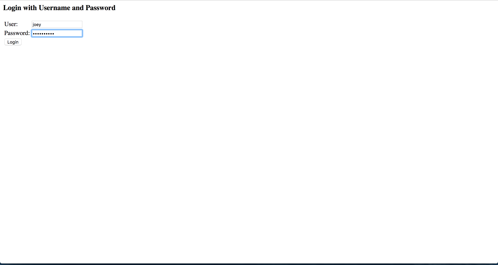
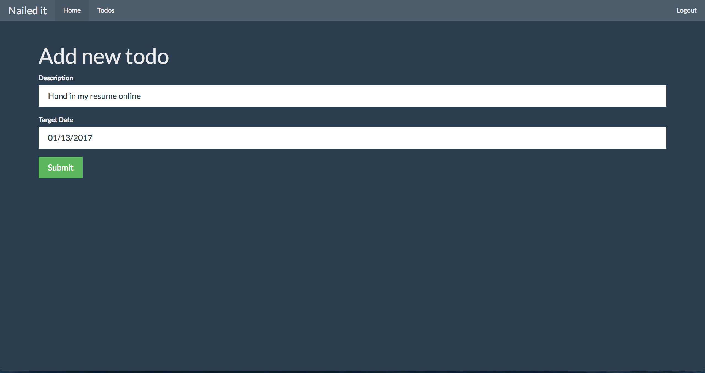
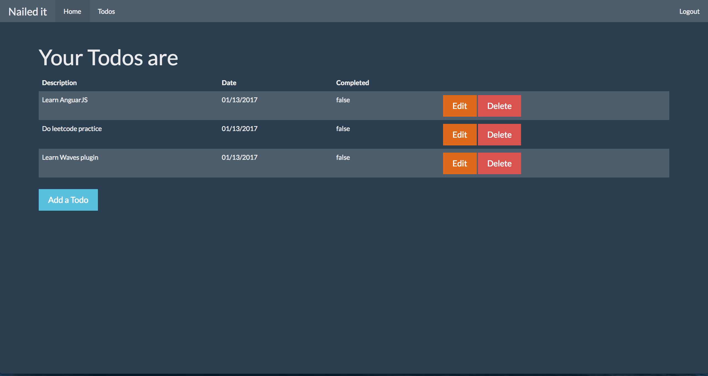

# Todo
A Todo list web app built with Java and Spring framework.
Based on a tutorial project which set up a basic Spring structure with Maven.
Not connected to database yet. All the backend data are hard coded in java files.

##Instruction
Clone to your desktop, right click the project and chose Maven -> Update Project
Run As -> Maven Build
Type "tomcat7:run" in "Goals"

Login username: joey 
Login password: zhangzewei

### login

### add

### manage

